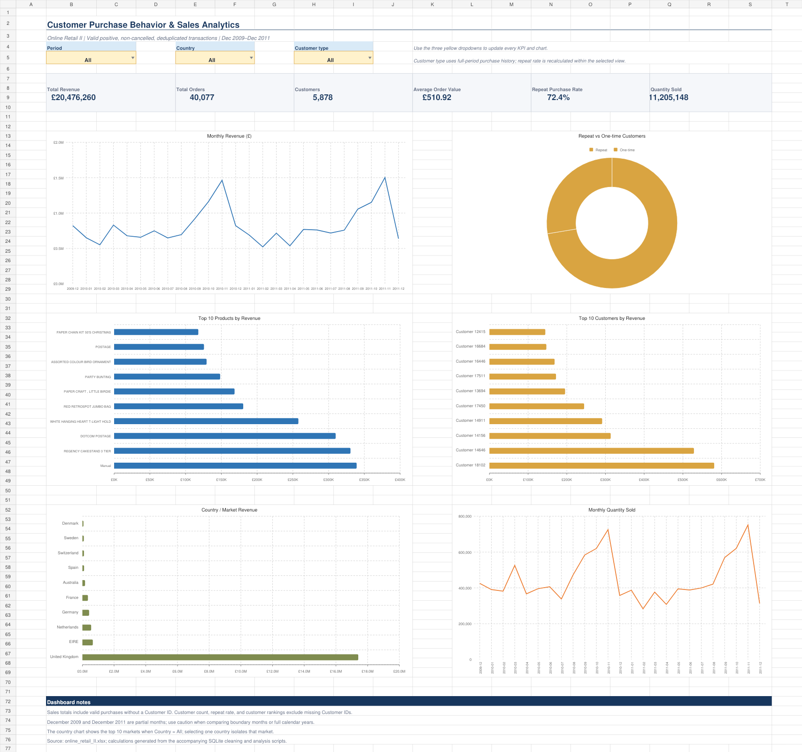

# Customer Purchase Behavior & Sales Analytics

Portfolio-ready SQL + Microsoft Excel analysis of the **Online Retail II** dataset. The project combines two yearly worksheets, applies reproducible SQLite cleaning rules, validates the resume claims, and presents customer, product, geographic, and time-series performance in an interactive Excel dashboard.

## Verified results

| KPI | Verified result | Resume claim | Assessment |
|---|---:|---:|---|
| Raw transaction records | 1,067,371 | 1.06M+ | Supported |
| Cleaned transaction records | 1,007,913 | — | Reported for transparency |
| Revenue | £20,476,260.45 | £20.4M+ | Supported |
| Distinct orders | 40,077 | 40K+ | Supported |
| Distinct known customers | 5,878 | 5.9K | Supported when rounded to one decimal thousand |
| Repeat customers | 4,255 | — | 72.39% of known customers |
| Repeat purchase rate | 72.39% | 72% | Supported when rounded |
| Average Order Value | £510.92 | £511 | Supported when rounded |
| Quantity sold | 11,205,148 | — | Verified |

Recommended resume wording:

> Analyzed 1.06M+ retail transaction lines across 40K+ orders and 5.9K customers, validating £20.48M in cleaned revenue, a 72.4% repeat-customer rate, and £510.92 average order value using SQL and Excel.

## Dashboard

Open `Customer_Purchase_Behavior_Sales_Dashboard.xlsx` in Microsoft Excel. The yellow **Period**, **Country**, and **Customer type** dropdowns update:

- Total Revenue, Orders, Customers, AOV, Repeat Purchase Rate, and Quantity Sold
- Monthly revenue and quantity trends
- Top 10 products and customers
- Repeat versus one-time customer mix
- Country / market revenue

The workbook also includes filterable analysis tables, a resume-metrics validation sheet, cleaning methodology, and source-derived data cubes.



## Methodology

The source grain is one invoice line. Revenue is calculated as:

`Revenue = Quantity × Price`

Cleaning rules:

1. Combine `Year 2009-2010` and `Year 2010-2011`.
2. Normalize invoice, stock code, description, country, date, quantity, price, and Customer ID types.
3. Exclude invoices beginning with `C` because they represent cancellations.
4. Exclude non-positive quantities and non-positive prices.
5. Require a nonblank invoice, stock code, country, and valid invoice date.
6. Remove exact duplicates across all eight original source fields.
7. Retain otherwise-valid rows with missing Customer IDs in sales and order KPIs.
8. Exclude missing Customer IDs only from customer count, repeat rate, and customer-level metrics.

This last rule is essential: excluding anonymous purchases from every KPI lowers revenue to £17.37M, orders to 36,969, and AOV to £469.98, which does not represent all valid sales activity.

See [Data Cleaning](docs/DATA_CLEANING.md) and [Metrics Validation](docs/METRICS_VALIDATION.md) for full details.

## Key business insights

- **Repeat customers drive value:** 4,255 repeat customers represent 72.39% of known customers and 96.78% of known-customer revenue. Their £475.71 AOV is 37.8% above the £345.21 one-time-customer AOV.
- **Revenue is concentrated:** the top 20% of known customers contribute 77.23% of known-customer revenue; the top 10 alone contribute 16.04%.
- **The United Kingdom dominates:** it contributes £17.41M, or 85.03% of total cleaned revenue. EIRE and the Netherlands follow at 3.22% and 2.71%.
- **November is the seasonal peak:** revenue reached £1.46M in November 2010 and £1.50M in November 2011. January-November 2011 revenue was 1.90% above the comparable 2010 period.
- **Customer identity coverage is a material limitation:** 228,488 clean rows lack Customer IDs. They represent £3.10M, or 15.15% of revenue, so customer-level analysis covers £17.37M rather than all revenue.
- **Product rankings include non-merchandise codes:** `M` (Manual), `DOT` (DOTCOM POSTAGE), and `POST` (Postage) appear among top lines. The leading named merchandise item is stock code `22423`, with £330,590.32 revenue.
- **A large transaction merits review:** stock code `23843` generated £168,469.60 from one invoice containing 80,995 units. It is retained because it passes the documented rules, but it can materially influence product rankings.

## Recommendations

1. Build loyalty and replenishment campaigns around repeat customers while using second-purchase incentives to move one-time buyers into the repeat segment.
2. Create high-value account monitoring for the top customer quintile because it contributes more than three quarters of known-customer revenue.
3. Start holiday inventory and campaign planning before September, with capacity prepared for the November peak.
4. Improve Customer ID capture at checkout; the current gap prevents 15.15% of revenue from being attributed to customer behavior.
5. Separate merchandise from fees, manual entries, postage, and adjustments in operational product reporting.
6. Add exception checks for unusually large quantities, order values, and administrative stock codes before using product rankings for purchasing decisions.
7. Diversify outside the UK selectively, prioritizing EIRE, the Netherlands, Germany, and France while monitoring market-specific AOV and order volume.

## Project structure

```text
Customer_Purchase_Behavior_Sales_Analytics/
├── Customer_Purchase_Behavior_Sales_Dashboard.xlsx
├── README.md
├── analysis_outputs/                 # SQL result extracts
├── dashboard_data/                   # Compact source-derived dashboard cubes
├── data/
│   └── cleaned_online_retail.csv.gz  # 1,007,913 cleaned rows
├── docs/
│   ├── DATA_CLEANING.md
│   ├── INTERVIEW_GUIDE.md
│   └── METRICS_VALIDATION.md
├── scripts/
│   ├── build_project_data.py
│   └── build_dashboard.mjs
└── sql/
    ├── 01_schema_cleaning.sql
    ├── 02_kpi_sales_analysis.sql
    └── 03_customer_behavior.sql
```

The raw workbook and generated SQLite database are intentionally excluded from version control because of their size. The compressed cleaned CSV is included.

## Reproduce the SQL analysis

Requirements: Python 3.11+, pandas, and openpyxl.

```bash
python scripts/build_project_data.py --source /path/to/online_retail_II.xlsx
```

The script loads both sheets into SQLite, executes the SQL cleaning model, exports all named SQL analyses, creates the compressed clean dataset, and refreshes the dashboard cubes. The included Excel workbook already contains the verified snapshot.

## Important limitations

- December 2009 and December 2011 are partial months; avoid treating them as full-period comparisons.
- Repeat purchase rate is descriptive, not cohort retention. It measures customers with at least two distinct clean invoices over the selected population.
- All revenue is treated as GBP because the source provides one `Price` field and no currency-conversion table.
- One `A`-prefixed adjustment invoice (`A563185`, “Adjust bad debt,” £11,062.06) is retained because it is positive and not cancelled. Excluding it would produce £20,465,198.39 revenue across 40,076 orders.

